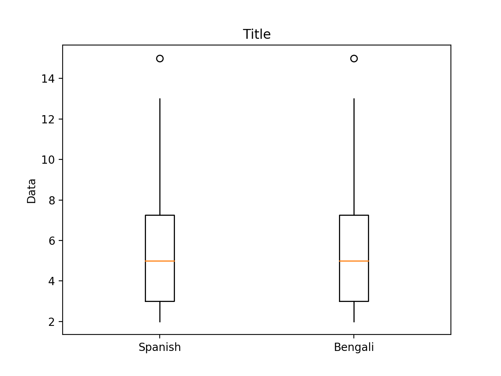

# Report

## Data

In this report, we are testing speak recognition. We tested three different native speakers using Google's speak recognition API. Here are the Levenshtein distances between the original text file and the specified audio:

- Male Spanish: `[4, 5, 4, 4, 3, 4, 5, 2, 12, 4, 3, 9, 6, 8, 12, 5, 6, 2, 3, 5, 2, 4, 5, 4]`

- Female English: `[4, 4, 4, 4, 3, 3, 2, 3, 12, 3, 3, 8, 6, 5, 10, 5, 5, 2, 2, 5, 2, 4, 5, 6]`

- Male Bengali: `[6, 5, 5, 4, 3, 5, 2, 3, 13, 4, 4, 12, 7, 11, 15, 8, 13, 2, 2, 5, 2, 3, 6, 4]`

## Plot

<figure>
    
    <figcaption>Figure 1: An example of the comparison by native languages</figcaption>
</figure>

<figure>
    
    <figcaption>Figure 2: An example of the comparison by genders</figcaption>
</figure>
